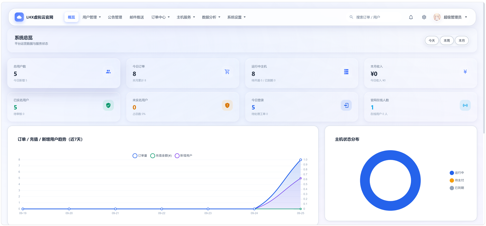
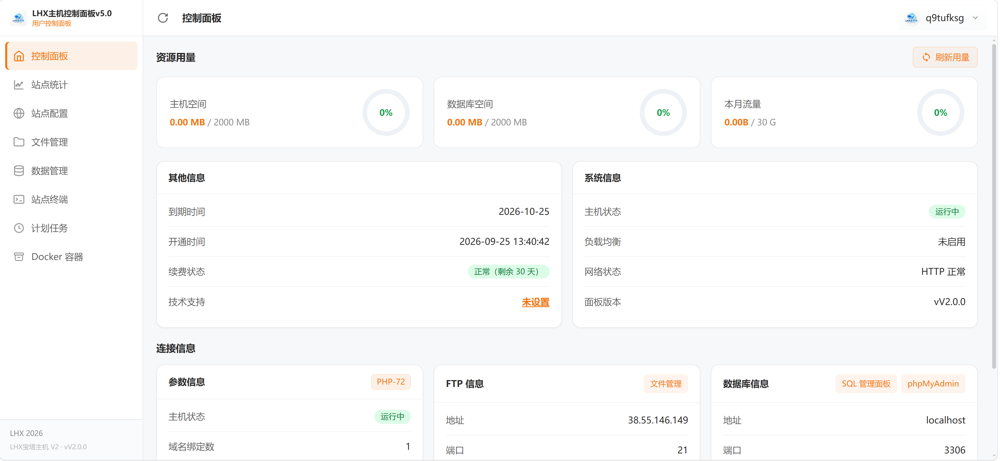

# LHX栖云  — 虚拟主机销售与管理系统

> 原名：虚拟云主机售卖系统（MNBT-SALE）。一套开箱即用的「云主机/虚拟主机售卖系统 + 用户主机控制面板」一体化解决方案，基于 ThinkPHP 5.0 开发，插件化对接梦奈宝塔（MNBT V2）、EasyPanel 等主机面板，支持自动开通、在线支付、Docker 容器增值销售。


---

## 界面预览

| 前台门户首页 | 后台管理首页 |
| :---: | :---: |
|  |  |
| 粉紫渐变主题、Live2D 看板娘、套餐展示、注册/购机入口 | 经营总览：用户/订单/主机/收入统计、7 日趋势图、主机状态分布 |

| 用户主机控制面板 |
| :---: |
|  |
| 资源用量、站点统计、文件管理、数据库、站点终端、计划任务、Docker 容器 |

---

## 项目简介

**LHX栖云** 面向个人与小型 IDC 创业者，把「卖主机」需要的所有环节做成了一个系统：

- **销售侧**：产品套餐展示、购物车下单、周期定价、加配计费、在线/余额/积分多种支付，支付成功后**自动在对接的面板中开通主机**。
- **用户侧**：每位用户拥有一个功能完整的**主机控制面板**（文件管理、数据库、站点终端、计划任务、Docker 容器等），并可自助续费、升级配置、转让主机。
- **管理侧**：后台覆盖用户、订单、主机、产品、服务器、支付、营销、公告、工单、日志、权限等全部运营能力。

> 「LHX栖云」取「栖于云上」之意——用户的网站栖息在云端，而这套系统就是售卖与托管这些云端居所的平台。

---

## 核心功能

### 一、销售系统（前台商城）

| 模块 | 说明 |
| --- | --- |
| 产品套餐 | 多套餐/多周期（月付、季付、年付、一次性、不限周期），支持每周期自定义价格、库存管理、会员等级折扣 |
| 购买配置页 `/cart` | 选择线路（服务器）、购买时长、空间/数据库/流量/域名加配计费、Docker 容器增值选项，价格实时联动 |
| 加购配置计费 | 按后台单价对空间、数据库、流量、域名超额部分自动加价（不受会员折扣影响） |
| 购物车 | 多套餐合并结算，支持余额支付与在线支付（充值→结算链路），`/cron` 兜底自动结算 |
| 开通方式 | 手动开通 / 延迟自动开通（可配置延迟分钟数）/ 支付成功立即开通，三种模式后台可配 |
| 余额系统 | 充值、消费、退款流水全程记录，交易明细可查 |
| 支付插件 | 易支付（epay）、支付宝当面付（f2fpay），插件化接入 `plugins/pay/`，可自行扩展 |
| 卡密系统 | 后台批量生成套餐卡密/余额卡密，用户自助兑换开通 |
| 积分体系 | 每日签到得积分、积分商城兑换商品、积分续费主机、积分抵扣套餐（套餐可设积分价） |
| 会员等级 | 等级折扣体系，购买自动按等级打折 |
| 推广返利 | 邀请链接（`/aff/:upper`）注册绑定上下级，消费返利，后台可配置返利比例与提现方式 |
| 活动中心 | 答题活动（quiz）、每日抽奖（lottery）、抽奖/答题排行榜，后台配置奖品与概率 |
| 域名商城 | 用户寄售/购买域名，站内担保交易 |
| 主机转让市场 | 用户间主机转让：挂售、购买、站内信沟通、短信验证确认、后台转让记录监管 |
| 实名认证 | 对接腾讯云市场二要素实名 API（姓名+身份证），后台人工复审、未实名用户统计 |
| 公告系统 | 前台公告页、已读状态记录、后台富文本发布 |
| 排行榜 | 消费/邀请等榜单展示页 `/rankings` |
| 数据大屏 | 独立大屏页 `/datav`，配合后台中国地图访客分布统计 |
| 门户美化 | Live2D 看板娘（AI 聊天接口）、GD 音乐台 BGM 点歌、自定义背景图批量上传、Logo 上传、多主题模板切换 |

### 二、用户主机控制面板（ClientArea）

用户购买主机后进入「产品控制台」，由对接的主机面板插件渲染功能模块（以下为梦奈宝塔 V2 插件提供的能力）：

| 模块 | 说明 |
| --- | --- |
| 资源用量 | 主机空间、数据库空间、本月流量实时用量与配额环形图 |
| 站点统计 | 站点访问统计 |
| 站点配置 | 域名绑定、PHP 版本切换、站点参数管理 |
| 文件管理 | 在线文件管理器 |
| 数据管理 | MySQL 数据库管理与 phpMyAdmin 快捷入口 |
| 站点终端 | 在线 Web 终端 |
| 计划任务 | Cron 计划任务管理 |
| Docker 容器 | Docker 容器开通/管理（见下文「Docker 容器增值功能」） |
| 连接信息 | FTP 地址/端口、数据库地址/端口、PHP 版本等一键查看 |
| 状态信息 | 主机状态（运行中/暂停）、到期时间、开通时间、续费状态、负载均衡、面板版本 |
| 自助续费 | 到期前续费，剩余天数提醒 |
| 密码自助 | 主机密码自助重置 |

插件化架构：`plugins/host/` 下已内置 **default（演示）、EasyPanel（康乐面板）、梦奈宝塔 MNBT V2** 三种对接插件，新面板只需按接口约定实现开通/暂停/续费/重置密码等函数即可接入。对接教程见 [docs/梦奈宝塔对接教程.md](docs/梦奈宝塔对接教程.md)、[docs/EasyPanel对接教程.md](docs/EasyPanel对接教程.md)。

### 三、Docker 容器增值功能

将 Docker 容器主机作为**付费增值商品**销售，全链路闭环：

- **购买时勾选**：购买配置页出现「开通 Docker 容器」卡片（需全局开关 + 产品开关 + 线路插件支持三者满足），费用叠加进整单，随主机订单一并结算。
- **控制台自助开通**：也支持购买后在产品控制台单独付费开通。
- **支付方式**：余额支付 / 在线支付（复用充值→结算链路），不支持积分抵扣。
- **开通模式**：`auto` 主机开通成功后自动调用面板 API 开通 Docker；`manual` 生成待办记录，管理员后台一键开通。
- **防重复扣费**：已开通/处理中状态重复点击自动拦截；关闭或失败后重新开通复用旧记录，避免二次扣费。
- **后台管理页 `/admin/docker`**：开通记录列表、按状态统计（已开通/待开通/失败）、手动开通、关闭、删除、为指定主机直接开通。

### 四、后台管理系统

| 分组 | 功能 |
| --- | --- |
| 经营总览 | 注册用户/今日订单/运行主机/本月收入/实名统计/今日登录/在线客服等统计卡片，7 日订单·充值·用户新增趋势折线图，主机状态分布环形图，今日/本周/本月切换 |
| 用户管理 | 用户列表与详情、实名审核、违规管理（违规通知对接面板）、未实名用户统计、IP 封禁管理、强制禁用 |
| 订单中心 | 订单列表/详情、交易记录、充值记录 |
| 主机服务 | 主机列表、手动开通、暂停/恢复/删除（支持批量）、Docker 开通管理、主机状态代理、转让记录监管 |
| 商品管理 | 产品分类、产品套餐（周期价格、库存、加配单价、Docker 开关、积分价）、服务器（线路）管理、面板对接配置 |
| 营销管理 | 促销活动与抽奖配置、积分商城商品、会员等级、推广返利设置、卡密生成与核销 |
| 内容管理 | 公告管理、邮件推送、帮助中心、门户模板/背景/Logo 设置 |
| 系统设置 | 站点信息、支付参数、实名 API、验证码（内置滑块 + 极验 GT3/GT4）、邮箱 SMTP、面板对接参数 |
| 权限与安全 | 多管理员 + 角色权限体系（admin_manager）、登录日志、操作日志、邮件发送审计 |
| 数据分析 | 访客统计、用户访问统计、中国地图访客分布、全局实时搜索（订单/用户） |

### 五、安全与风控

- 内置滑块验证码 + 极验行为验证（GT3/GT4）双套方案
- 登录日志、后台操作日志、邮件审计全程留痕
- IP 封禁管理（后台手动封禁/解封）
- QQ 群验证对接（`/user/qqGroupVerify`，群成员才可注册/购买）
- 违规主机通知与处理（与梦奈宝塔违规通知接口联动）
- 系统救援工具箱（`rescue.php` / `系统救援工具箱.sh`）：后台密码找回、紧急修复

---

## 环境要求

| 项 | 要求 |
| --- | --- |
| PHP | 7.4 及以上，需启用 `curl`、`pdo_mysql`、`gd`、`mbstring` 扩展 |
| Web 服务器 | Nginx / Apache，将站点根目录指向项目根目录（入口 `index.php`） |
| 数据库 | MySQL 5.6+ |
| 定时任务 | 建议宝塔面板添加计划任务访问 `http://你的域名/cron`（每 1~5 分钟），用于延迟开通、在线支付订单兜底结算、Docker 订单自动结算 |
| 主机面板 | 梦奈宝塔 MNBT V2 或 EasyPanel（二选一即可，也可先用 default 插件体验） |

## 快速安装

1. 上传全部代码到网站根目录（或从 Release 下载打包版）。
2. 浏览器访问 `http://你的域名/install`，按 **6 步安装向导**完成环境检测、数据库配置与管理员初始化。
3. 登录后台 `/admin`，在「服务器管理」中按 [docs/梦奈宝塔对接教程.md](docs/梦奈宝塔对接教程.md) 或 [docs/EasyPanel对接教程.md](docs/EasyPanel对接教程.md) 添加主机面板服务器。
4. 在「产品管理」中创建套餐并关联服务器线路，设置周期价格与库存。
5. 在「支付配置」中启用易支付 / 当面付，配置商户参数。
6. 添加 `/cron` 定时任务，即可上线销售。

## 目录结构

```
├── app/
│   ├── index/               # 前台（商城、用户中心、控制台入口）
│   ├── admin/               # 后台管理
│   ├── install/             # 安装向导
│   ├── common.php           # 公共函数（Docker、购物车、周期价格等 helper）
│   └── route.php            # 全站路由表
├── frame/                   # ThinkPHP 5.0.24 框架核心
├── plugins/
│   ├── host/                # 主机面板插件：default / easypanel / mnbt（梦奈宝塔V2）
│   └── pay/                 # 支付插件：epay（易支付）/ f2fpay（支付宝当面付）
├── docs/                    # 面板对接教程
├── dvsvd/                   # 展示截图
├── public/                  # 静态资源
├── install/                 # 安装器资源
├── CHANGELOG.md             # 更新日志
└── rescue.php               # 系统救援工具
```

## 更新日志（节选）

完整记录见 [CHANGELOG.md](CHANGELOG.md)。

| 版本 | 内容 |
| --- | --- |
| v1.3.9 | Docker 容器开通整合进购买配置页：下单时勾选、费用随单结算、开通成功后按模式自动/人工开通 |
| v1.3.8 | Docker 容器开通（产品控制台自助按钮）、`/admin/docker` 后台管理、防二次扣费 |
| v1.3.7 | 系统救援工具箱、登录入口优化、卡密升级 |
| v1.3.6 | 安装向导 UI 重构（6 步竖向步骤 + 蓝白主题） |
| v1.3.5 | 性能与体验优化、安全加固 |
| v1.2.0 | 活动中心（答题/抽奖）、域名商城、数据大屏 |
| v1.1.0 | 积分体系、会员等级、推广返利、主机转让市场 |

## 适用场景

- 个人/工作室搭建虚拟主机、建站资源销售站
- 小型 IDC 商家对接梦奈宝塔、EasyPanel 实现自动化售卖
- 二次元风格建站服务商（自带 Live2D、BGM、多主题皮肤）
- 需要「销售系统 + 用户控制面板」一体化、开箱即用的主机零售方案

## 开源协议

本项目基于 [MIT License](LICENSE) 开源，可自由二次开发与部署，请保留原始版权声明。

---

**LHX栖云** —— 让每一台主机，都栖于云端。

## 声明

本项目部分代码来源于 SIB-HOST（sib.cc 思博系统），在此对原作者表示感谢。本项目仅供学习交流使用，请勿用于非法用途。
